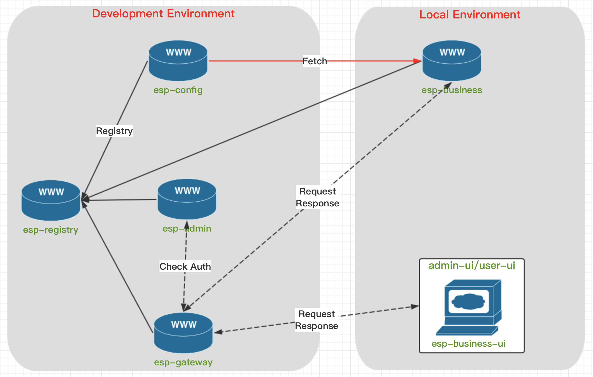
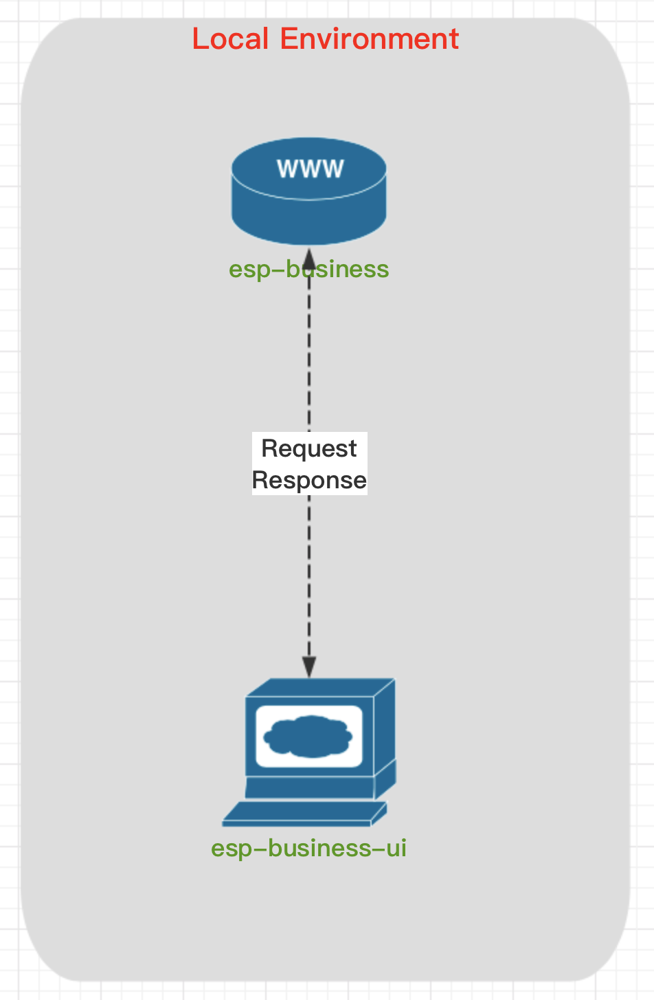

# esp-framework

Enterprise Service Platform Framework

## Services

参数说明：

- CFG_EUREKA_HOST: registry server address
- CFG_EUREKA_PORT: registry server port
- CFG_CONFIG_HOST: config server address
- CFG_CONFIG_PORT: config server port

以上参数主要用于`docker`部署时直接指定。

### esp-registry

服务注册中心，使用本地单独配置。

### esp-config

分布式远程配置中心，使用本地单独配置。

### esp-gateway

服务网关，使用远程配置(参考`esp-gateway/bootstrap.yml`)。

新增服务需要在配置文件`esp-gateway/application.yml`中配置属性`spring.cloud.gateway.routes`的节点，e.g.:

```yaml
spring:
  cloud:
    gateway:
      routes:
      - id: route-esp-admin
        uri: lb://esp-admin
        predicates:
        - Path=/api/admin/**
      - id: route-esp-food
        uri: lb://esp-food
        predicates:
        - Path=/api/food/**
```

## Development

公用服务(开发环境): `esp-registry`/`esp-config`/`esp-gateway`

**`GitLab`配置仓库**和**数据库**没有体现在图中。

数据库统一使用**开发环境库**。

两种开发模式根据具体业务进行选择。

### 1. 使用公用服务



本地需要启动如下服务:

- `esp-business` 
- `admin-ui/user-ui`
- `esp-business-ui`

`UI`端使用的是嵌套模式，即`admin-ui/user-ui`中配置菜单指向`esp-business-ui`。

### 2. 不使用公用服务



- `esp-business`需要禁用**远程配置**和**服务注册**功能
- `esp-business-ui`需要把代理目标直接指向本地`esp-business`
- 开发完成，最终提交，一定要注意配置文件，有些配置需要放到**远程配置中心**，并且启用**远程配置**和**服务注册**功能
